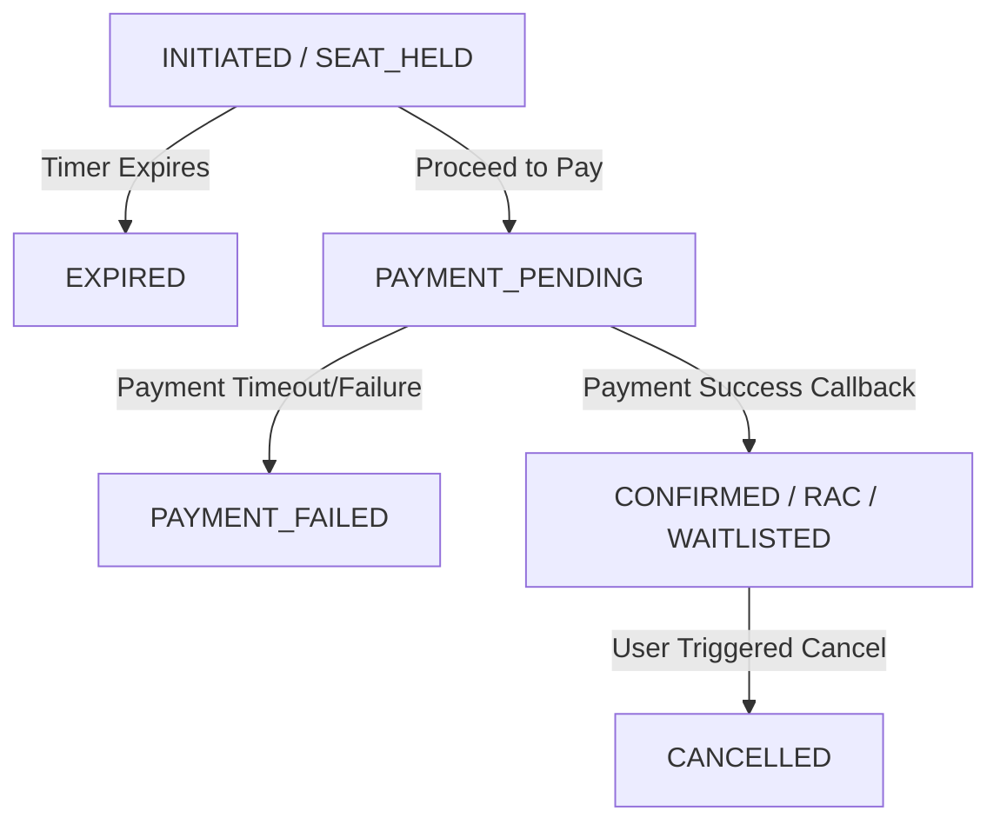

# Booking State Machine & Rules

This document outlines the lifecycles and business rules for transactions, seat holding, and payment recovery.

## 1. Unified Booking State Flow

## 2. Core State Definitions

- `SEAT_HELD`: Temporary Redis lock granted for user to provide payment details.
- `PAYMENT_PENDING`: Gateway session created, awaiting webhook.
- `CONFIRMED`: Ticket secured, PNR allocated.
- `RAC` (Reservation Against Cancellation): Allowed to board, seat assigned upon someone else's cancellation.
- `WAITLISTED`: Not allowed to board until promoted to RAC or Confirmed.
- `EXPIRED`: Hold timer elapsed before payment completion.
- `PAYMENT_FAILED`: Issue processing callback.

## 3. Edge Case Handling Rules

### 3.1 Duplicate Payment Callback
- **Rule:** Handled idempotently. Once a payment intent's transaction ID is marked `SUCCESS`, any subsequent identical callback is logged and returns HTTP 200 without creating a duplicate ticket.

### 3.2 Payment Callback arrives AFTER Hold Expiry
- **Rule:** 
  1. Mark payment as `SUCCESS_LATE`.
  2. Attempt to secure seat from current live inventory.
  3. If capacity exists, grant ticket and mark `CONFIRMED`.
  4. If full, queue an automatic refund process and mark `REFUND_PENDING`, alerting the user.

### 3.3 Cancellation vs Promotion Race Condition
- **Rule:** Handled inside a MongoDB Transaction.
  1. Lock inventory row. 
  2. Increase available seats.
  3. Run Promotion algorithm. 
  4. Commit.

### 3.4 Concurrency at Last Seat
- **Rule:** Atomicity. Two users query availability, both see "1 Seat". User A clicks "Book", backend creates Redis lock. User B clicks "Book" 50ms later, backend denies request with `SEAT_UNAVAILABLE`.
