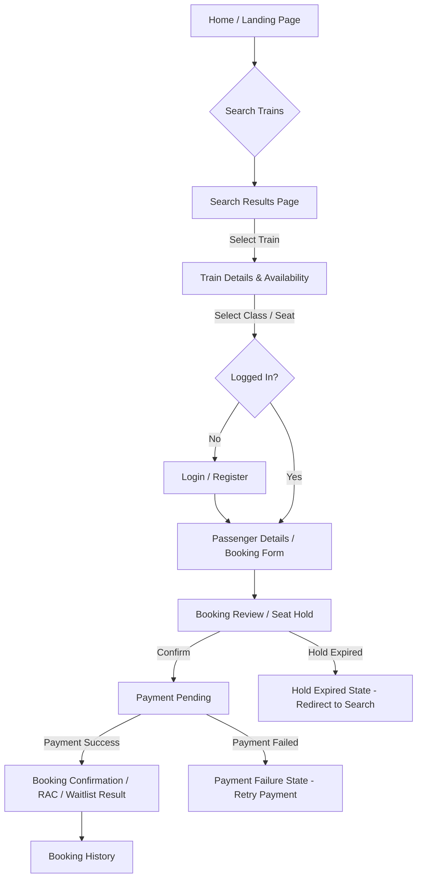
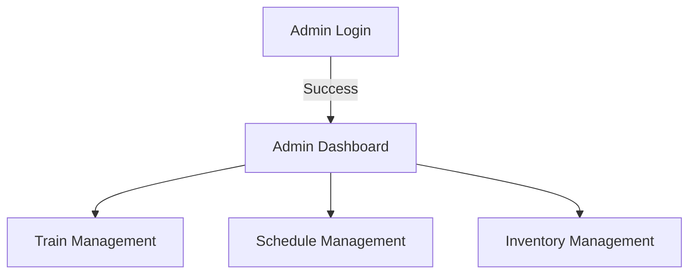

# Frontend User Flow

This document outlines the main user journeys for the Train Ticket Booking System.

## Passenger Flow

## Admin Navigation Flow

## Special Edge Case Flows

- **Cancellation:**
  - `Booking History` -> Select Active Booking -> `Cancel Action` -> Confirm -> `Cancellation Result Page`.
- **Availability Change:**
  - `Search Results` -> `Train Details` -> if stale, show real-time change -> Update UI to reflect Waitlist/RAC.
- **Seat Hold Timeout:**
  - Timer active on `Booking Review`. If reaches 0: user is prompted to restart search.
